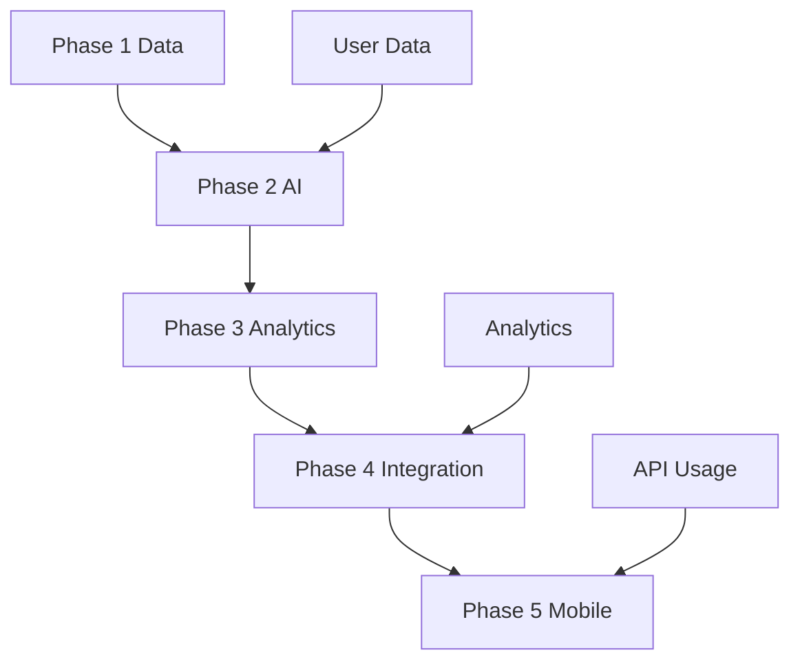

# Documentation Review Checklist

## Phase 1: Lead & Deal Management MVP

### Core Functionality Alignment
- [x] Database schema properly defined
- [x] Authentication flow documented
- [x] CRUD operations specified
- [x] UI components identified
- [x] API endpoints mapped

### Technical Requirements Validation
- [x] React 18+ with TypeScript setup
- [x] Supabase integration plan
- [x] HeroUI components usage
- [x] TailwindCSS configuration
- [x] Testing strategy defined

### Potential Implementation Challenges
1. Data Structure
   - Complex relationships between contacts and deals
   - Custom fields implementation
   - Activity timeline optimization

2. Performance Considerations
   - Initial data load optimization
   - Real-time updates handling
   - Large dataset management

## Phase 2: AI-Powered Features

### AI Integration Readiness
- [x] OpenAI API integration documented
- [x] Model selection justified
- [x] Data processing pipeline defined
- [x] Error handling strategies specified
- [x] Fallback mechanisms planned

### Data Requirements Validation
1. Training Data
   - Sufficient historical data needed
   - Data quality standards defined
   - Privacy considerations addressed

2. Model Integration
   - API rate limiting considered
   - Response time requirements defined
   - Cost optimization strategies planned

## Phase 3: Analytics & Optimization

### Analytics Implementation
- [x] Key metrics defined
- [x] Data aggregation methods specified
- [x] Visualization components selected
- [x] Export functionality detailed
- [x] Performance monitoring planned

### Database Optimization
1. Query Performance
   - Indexing strategy defined
   - Query optimization planned
   - Cache strategy documented

2. Data Aggregation
   - Materialized views planned
   - Batch processing defined
   - Archive strategy specified

## Phase 4: Integration & API Ecosystem

### API Platform Readiness
- [x] API documentation standards set
- [x] Authentication methods defined
- [x] Rate limiting strategy planned
- [x] Versioning approach specified

### Integration Framework
1. Webhook System
   - Event types defined
   - Delivery mechanisms planned
   - Error handling specified

2. Third-party Integrations
   - Integration points identified
   - Data mapping defined
   - Security measures planned

## Phase 5: Mobile & Advanced Features

### Mobile Architecture
- [x] React Native setup documented
- [x] Offline capabilities planned
- [x] Sync strategy defined
- [x] Native features identified

### Advanced Features
1. Device Integration
   - Camera usage defined
   - Location services planned
   - Push notifications specified

2. Performance
   - Battery optimization planned
   - Data usage optimization
   - Storage management defined

## Cross-Phase Dependencies

### Data Flow Validation


### Security Measures
1. Authentication
   - [x] JWT implementation planned
   - [x] Role-based access defined
   - [x] Session management specified

2. Data Protection
   - [x] Encryption methods defined
   - [x] Privacy compliance planned
   - [x] Audit logging specified

## Technical Architecture Review

### Infrastructure Setup
1. Development Environment
   - [x] Local setup documented
   - [x] Dependencies listed
   - [x] Configuration management planned

2. Production Environment
   - [x] Scaling strategy defined
   - [x] Backup procedures documented
   - [x] Monitoring setup planned

### Code Organization
```typescript
interface ProjectStructure {
  src: {
    components: {
      common: 'Reusable components',
      features: 'Feature-specific components',
      layouts: 'Layout components'
    },
    services: {
      api: 'API integration',
      auth: 'Authentication',
      ai: 'AI services'
    },
    utils: {
      helpers: 'Helper functions',
      constants: 'Constants',
      types: 'TypeScript types'
    }
  }
}
```

## Implementation Readiness

### Phase 1 Readiness Checklist
1. Technical Setup
   - [x] Project initialization
   - [x] Development environment
   - [x] CI/CD pipeline
   - [x] Testing framework

2. Feature Implementation
   - [x] Component library ready
   - [x] Database setup planned
   - [x] API structure defined
   - [x] Authentication flow planned

### Risk Assessment
| Risk | Impact | Mitigation | Status |
|------|--------|------------|---------|
| Data migration | High | Incremental approach | Planned |
| Performance | Medium | Optimization strategies | Documented |
| Security | High | Security measures | Defined |
| User adoption | Medium | Training plan | Drafted |

## Documentation Completeness

### Technical Documentation
- [x] Architecture overview
- [x] API documentation
- [x] Database schema
- [x] Security measures
- [x] Deployment process

### User Documentation
- [x] Feature documentation
- [x] User guides planned
- [x] Admin documentation
- [x] API guides
- [x] Integration guides

## Open Questions & Considerations

### Technical Decisions
1. State Management
   - Confirm React Query + Context approach
   - Define global state requirements
   - Plan data caching strategy

2. Performance Optimization
   - Review lazy loading strategy
   - Assess bundle splitting approach
   - Evaluate caching mechanisms

### Implementation Strategy
1. Phased Rollout
   - Define feature flags strategy
   - Plan beta testing approach
   - Establish feedback loops

2. Quality Assurance
   - Define test coverage requirements
   - Plan performance testing
   - Establish QA processes

## Next Steps

### Immediate Actions
1. Development Setup
   - Initialize project repository
   - Setup development environment
   - Configure CI/CD pipeline

2. Sprint Planning
   - Break down Phase 1 tasks
   - Assign responsibilities
   - Set milestones

### Documentation Updates
1. Living Documentation
   - Setup documentation site
   - Define update process
   - Establish review cycles

2. Knowledge Sharing
   - Plan team onboarding
   - Schedule technical reviews
   - Establish communication channels

## Review Summary

### Documentation Status
- All phases thoroughly documented
- Technical requirements defined
- Dependencies mapped
- Risks identified
- Implementation strategy planned

### Areas Needing Attention
1. Technical Details
   - Finalize API specifications
   - Complete component library setup
   - Define exact testing requirements

2. Process Requirements
   - Establish code review process
   - Define release procedures
   - Plan monitoring setup

### Recommendation
Based on the comprehensive review:
- Documentation is well-structured and complete
- Technical decisions are well-justified
- Dependencies are clearly mapped
- Implementation plan is realistic

Ready to proceed with Phase 1 implementation after team review and approval.