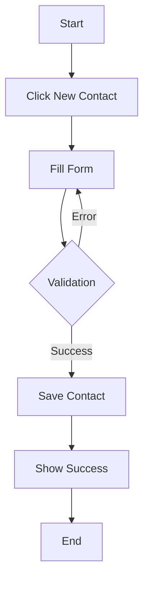

# Phase 1: Lead & Deal Management MVP - Product Requirements Document

## Overview
This document outlines the requirements and specifications for Phase 1 of the AI-powered CRM system, focusing on core lead and deal management functionality.

## Scope

### In Scope
- User authentication and authorization
- Contact/lead management
- Basic deal pipeline
- Activity tracking
- Essential UI components
- Data persistence layer

### Out of Scope
- Advanced AI features (Phase 2)
- Complex analytics
- Integration with external systems
- Mobile application
- Bulk operations

## Assumptions & Dependencies
- Users have modern web browsers (Chrome, Firefox, Safari, Edge)
- Internet connectivity required
- OpenAI API availability (for future phases)
- Supabase service availability

## User Personas

### Sales Representative
- Primary user of the system
- Manages leads and deals daily
- Needs quick access to contact information
- Tracks activities and follow-ups

### Sales Manager
- Oversees team performance
- Reviews deal pipeline
- Needs access to team metrics
- Manages team permissions

## Functional Requirements

### Authentication & Authorization
1. User Registration
   - Email/password registration
   - Google OAuth integration
   - Email verification flow
   - Password reset functionality

2. Role-Based Access
   - Admin role
   - Manager role
   - Sales rep role
   - Role permission matrix

### Contact Management
1. Contact Creation
   - Required fields:
     - First name
     - Last name
     - Email
     - Company
     - Phone (optional)
     - Title (optional)
   - Custom field support
   - Data validation

2. Contact Views
   - List view with filtering
   - Detail view with activity history
   - Edit/Delete capabilities
   - Search functionality

### Deal Pipeline
1. Deal Creation
   - Required fields:
     - Title
     - Value
     - Stage
     - Expected close date
     - Associated contact
   - Deal stage customization
   - Value calculation

2. Pipeline View
   - Kanban board interface
   - Drag-and-drop functionality
   - Stage transition
   - Deal cards with key info

### Activity Tracking
1. Activity Types
   - Calls
   - Emails
   - Meetings
   - Notes

2. Activity Features
   - Timeline view
   - Activity creation
   - Activity linking to deals/contacts
   - Date/time tracking

## Technical Requirements

### Frontend Architecture
1. Project Structure
```typescript
/src
  /components
    /auth        // Authentication components
    /contacts    // Contact-related components
    /deals       // Deal-related components
    /activities  // Activity components
    /common      // Shared UI components
  /hooks         // Custom React hooks
  /services     // API services
  /types        // TypeScript definitions
  /utils        // Helper functions
  /styles       // Global styles
```

2. Component Library Integration
   - HeroUI component usage
   - Custom component development
   - Responsive design implementation

### Data Layer
1. Database Schema
```sql
-- Contacts Table
CREATE TABLE contacts (
  id UUID PRIMARY KEY DEFAULT uuid_generate_v4(),
  first_name TEXT NOT NULL,
  last_name TEXT NOT NULL,
  email TEXT UNIQUE NOT NULL,
  company TEXT,
  title TEXT,
  phone TEXT,
  created_at TIMESTAMP WITH TIME ZONE DEFAULT TIMEZONE('utc', NOW()),
  updated_at TIMESTAMP WITH TIME ZONE DEFAULT TIMEZONE('utc', NOW())
);

-- Deals Table
CREATE TABLE deals (
  id UUID PRIMARY KEY DEFAULT uuid_generate_v4(),
  title TEXT NOT NULL,
  value NUMERIC NOT NULL,
  stage TEXT NOT NULL,
  contact_id UUID REFERENCES contacts(id),
  close_date DATE,
  created_at TIMESTAMP WITH TIME ZONE DEFAULT TIMEZONE('utc', NOW()),
  updated_at TIMESTAMP WITH TIME ZONE DEFAULT TIMEZONE('utc', NOW())
);

-- Activities Table
CREATE TABLE activities (
  id UUID PRIMARY KEY DEFAULT uuid_generate_v4(),
  type TEXT NOT NULL,
  description TEXT,
  deal_id UUID REFERENCES deals(id),
  contact_id UUID REFERENCES contacts(id),
  created_at TIMESTAMP WITH TIME ZONE DEFAULT TIMEZONE('utc', NOW())
);
```

2. API Integration
   - React Query setup
   - Typed API responses
   - Error handling
   - Loading states

## User Interface

### Design System
1. Colors
   - Primary: #2563eb (blue-600)
   - Secondary: #475569 (slate-600)
   - Success: #16a34a (green-600)
   - Warning: #ca8a04 (yellow-600)
   - Danger: #dc2626 (red-600)

2. Typography
   - Font: Inter
   - Headings: 
     - H1: 2.25rem/2.5rem
     - H2: 1.875rem/2.25rem
     - H3: 1.5rem/2rem
   - Body: 1rem/1.5rem

3. Component Styling
   - Consistent spacing
   - Responsive breakpoints
   - Accessibility compliance

### Key Screens

1. Dashboard
   - Quick stats
   - Recent activities
   - Deal pipeline summary
   - Contact shortcuts

2. Contact List
   - Filterable table
   - Quick actions
   - Search functionality
   - Pagination

3. Deal Board
   - Kanban layout
   - Stage columns
   - Deal cards
   - Quick edit

4. Activity Timeline
   - Chronological view
   - Activity filters
   - Create new activity
   - Activity details

## Performance Requirements
- Page load time < 2 seconds
- API response time < 500ms
- Support for 10,000+ contacts
- Support for 5,000+ deals
- Concurrent users: 100+

## Security Requirements
- Data encryption at rest
- Secure API endpoints
- Input sanitization
- XSS prevention
- CSRF protection
- Rate limiting

## Testing Requirements
1. Unit Tests
   - Component testing
   - Utility function testing
   - Hook testing

2. Integration Tests
   - User flows
   - API integration
   - State management

3. E2E Tests
   - Critical user journeys
   - Cross-browser testing

## Success Metrics
1. User Engagement
   - Daily active users
   - Session duration
   - Feature usage

2. Performance
   - Load time
   - Error rates
   - API response time

3. Business Metrics
   - User adoption rate
   - Deal closure rate
   - Activity completion rate

## Development Phases

### Week 1-2: Foundation
- Project setup
- Authentication implementation
- Database schema setup
- Basic UI components

### Week 3-4: Core Features
- Contact management
- Deal pipeline
- Activity tracking
- Basic dashboard

### Week 5-6: Polish & Testing
- UI/UX refinement
- Performance optimization
- Testing implementation
- Documentation

## Risks & Mitigation

| Risk | Impact | Mitigation |
|------|---------|------------|
| Data loss | High | Regular backups, validation |
| Performance issues | Medium | Optimization, monitoring |
| User adoption | High | Training, documentation |
| Security breach | High | Security audit, testing |

## Future Considerations
- AI feature integration
- Mobile app development
- External integrations
- Advanced analytics
- Bulk operations
- Custom reporting

## Appendix

### API Endpoints

```typescript
// Contacts
GET    /api/contacts
POST   /api/contacts
GET    /api/contacts/:id
PUT    /api/contacts/:id
DELETE /api/contacts/:id

// Deals
GET    /api/deals
POST   /api/deals
GET    /api/deals/:id
PUT    /api/deals/:id
DELETE /api/deals/:id

// Activities
GET    /api/activities
POST   /api/activities
GET    /api/activities/:id
PUT    /api/activities/:id
DELETE /api/activities/:id
```

### User Flow Diagrams

1. Contact Creation Flow


2. Deal Pipeline Flow
```mermaid
graph TD
    A[Start] --> B[View Pipeline]
    B --> C[Drag Deal]
    C --> D[Update Stage]
    D --> E{Save Changes}
    E -->|Success| F[Update UI]
    E -->|Error| G[Show Error]
    F --> H[End]
    G --> B