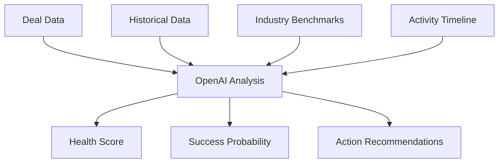
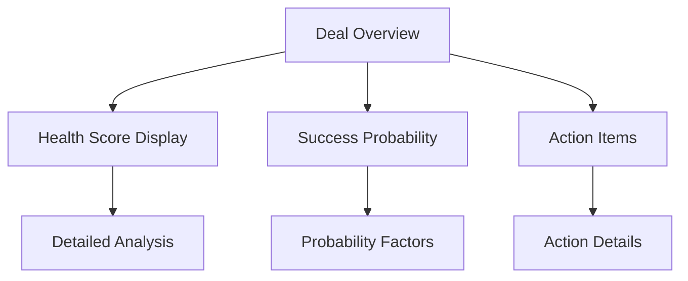

# Phase 2: AI-Powered Deal Intelligence - Product Requirements Document

## Overview
Phase 2 focuses on implementing AI capabilities to enhance deal management, provide intelligent insights, and automate decision support. This phase builds upon the core CRM functionality established in Phase 1.

## Scope

### In Scope
- Deal Coach AI system
- Customer Persona Builder
- Smart Objection Handler
- Success probability prediction
- Pattern analysis engine
- AI-driven recommendations

### Out of Scope
- Natural language deal creation
- Automated email writing
- Voice analysis
- Complex chatbot interactions
- Automated deal negotiation

## Assumptions & Dependencies
- Phase 1 functionality is complete and stable
- OpenAI API reliability and availability
- Sufficient historical data for pattern analysis
- User acceptance of AI recommendations
- Data quality from Phase 1

## AI Feature Requirements

### 1. Deal Coach System

#### Functionality
1. Deal Health Scoring
   ```typescript
   interface DealHealthScore {
     overallScore: number;          // 0-100
     keyFactors: {
       factor: string;
       impact: number;              // -5 to +5
       recommendation: string;
     }[];
     trend: 'improving' | 'stable' | 'declining';
     lastUpdated: Date;
   }
   ```

2. Success Probability Calculator
   - Historical pattern analysis
   - Similar deal comparison
   - Industry benchmarking
   - Real-time probability updates

3. Next Action Recommendations
   ```typescript
   interface ActionRecommendation {
     action: string;
     priority: 'high' | 'medium' | 'low';
     reasoning: string;
     expectedImpact: number;        // 0-100
     deadline?: Date;
     prerequisites?: string[];
   }
   ```

#### AI Integration Points


### 2. Persona Builder System

#### Database Schema Extensions
```sql
ALTER TABLE contacts ADD COLUMN IF NOT EXISTS 
  persona_data JSONB DEFAULT '{
    "communication_style": null,
    "decision_factors": [],
    "behavioral_patterns": [],
    "preferences": {},
    "risk_profile": null
  }';
```

#### Functionality
1. Communication Style Analysis
   - Tone preference detection
   - Response time patterns
   - Meeting participation style
   - Communication channel preference

2. Behavioral Pattern Detection
   ```typescript
   interface BehavioralPattern {
     pattern: string;
     confidence: number;           // 0-1
     supportingEvidence: string[];
     implications: string[];
     recommendedApproach: string;
   }
   ```

3. Buying Motivation Analysis
   - Decision factor identification
   - Budget sensitivity analysis
   - Timeline sensitivity
   - Risk tolerance assessment

#### AI Training Data Requirements
- Minimum 50 successful deals
- 6 months of interaction history
- Various interaction types coverage
- Diverse customer base

### 3. Smart Objection Handler

#### Database Schema
```sql
CREATE TABLE IF NOT EXISTS objection_patterns (
  id UUID PRIMARY KEY DEFAULT uuid_generate_v4(),
  pattern TEXT NOT NULL,
  category TEXT NOT NULL,
  successful_responses JSONB[],
  context_factors JSONB,
  success_rate NUMERIC,
  created_at TIMESTAMP WITH TIME ZONE DEFAULT NOW()
);
```

#### Functionality
1. Real-time Objection Analysis
   ```typescript
   interface ObjectionAnalysis {
     type: string;
     severity: 'low' | 'medium' | 'high';
     underlying_concern: string;
     recommended_responses: {
       response: string;
       success_rate: number;
       context: string;
     }[];
     fallback_options: string[];
   }
   ```

2. Response Template System
   - Dynamic template generation
   - Success rate tracking
   - Context-aware selection
   - Personalization factors

3. Learning System
   ```typescript
   interface ResponseFeedback {
     objection_id: string;
     response_used: string;
     successful: boolean;
     context_factors: Record<string, any>;
     follow_up_needed: boolean;
     customer_satisfaction: number; // 1-5
   }
   ```

## Technical Architecture

### AI Service Layer
```typescript
interface AIService {
  // Deal Coach
  analyzeDealHealth(dealId: string): Promise<DealHealthScore>;
  predictSuccess(dealId: string): Promise<number>;
  suggestNextActions(dealId: string): Promise<ActionRecommendation[]>;
  
  // Persona Builder
  analyzePersona(contactId: string): Promise<PersonaAnalysis>;
  updateBehavioralPatterns(contactId: string): Promise<BehavioralPattern[]>;
  
  // Objection Handler
  handleObjection(objection: string, context: ObjectionContext): Promise<ObjectionAnalysis>;
  submitResponseFeedback(feedback: ResponseFeedback): Promise<void>;
}
```

### OpenAI Integration
1. Prompt Engineering
```typescript
interface PromptTemplate {
  template: string;
  parameters: {
    name: string;
    type: string;
    required: boolean;
    description: string;
  }[];
  example_output: string;
  validation_rules: string[];
}
```

2. Response Processing
```typescript
interface AIResponse {
  raw_response: string;
  parsed_data: any;
  confidence_score: number;
  processing_time: number;
  token_usage: {
    prompt_tokens: number;
    completion_tokens: number;
    total_tokens: number;
  };
}
```

### Caching Strategy
1. Response Caching
   - Cache duration: 1 hour for deal analysis
   - Cache duration: 24 hours for persona analysis
   - Cache invalidation on new activities
   - Partial cache updates

2. Performance Optimization
   - Batch analysis for multiple deals
   - Background processing for non-urgent analysis
   - Incremental updates
   - Rate limiting implementation

## User Interface Requirements

### Deal Coach Dashboard


### Persona Insights Panel
1. Visual Components
   - Communication style radar chart
   - Behavioral pattern timeline
   - Preference indicators
   - Motivation breakdown

2. Interactive Elements
   - Drill-down analysis
   - Historical trend viewing
   - Pattern confirmation
   - Manual override options

### Objection Handler Interface
1. Real-time Suggestions
   - Quick response panel
   - Success probability indicators
   - Context-aware filters
   - Feedback collection

## Performance Requirements
- AI response time < 1 second
- Batch analysis completion < 5 minutes
- Cache hit ratio > 80%
- API rate limit compliance
- Minimal UI latency

## Security & Privacy
1. Data Protection
   - PII handling compliance
   - Data retention policies
   - Access control levels
   - Audit logging

2. AI Ethics
   - Bias monitoring
   - Decision transparency
   - Manual override options
   - Ethical use guidelines

## Testing Strategy

### AI Component Testing
1. Unit Tests
   - Prompt generation
   - Response parsing
   - Cache management
   - Error handling

2. Integration Tests
   - OpenAI API integration
   - Database interactions
   - Cache system
   - Event handling

3. Performance Tests
   - Response time under load
   - Concurrent request handling
   - Cache effectiveness
   - Resource utilization

### User Acceptance Criteria
1. Deal Coach
   - Accuracy > 80% for success prediction
   - Relevant next actions
   - Clear explanation of scores
   - Timely updates

2. Persona Builder
   - Accurate communication style detection
   - Useful behavioral insights
   - Regular pattern updates
   - Actionable recommendations

3. Objection Handler
   - Relevant response suggestions
   - Quick response time
   - High success rate
   - Effective learning system

## Implementation Phases

### Week 1-2: AI Foundation
- OpenAI integration setup
- Prompt engineering system
- Response processing framework
- Caching infrastructure

### Week 3-4: Core AI Features
- Deal Coach implementation
- Persona Builder basic analysis
- Objection Handler framework
- Initial UI integration

### Week 5-6: Enhancement & Training
- Model fine-tuning
- Response optimization
- Performance improvements
- User feedback integration

## Success Metrics
1. Quantitative Metrics
   - Prediction accuracy
   - Response success rate
   - System adoption rate
   - Performance metrics

2. Qualitative Metrics
   - User satisfaction
   - Feature usefulness
   - Recommendation relevance
   - Ease of use

## Risk Management

| Risk | Impact | Mitigation |
|------|--------|------------|
| AI accuracy | High | Regular model training, feedback loops |
| API reliability | High | Fallback systems, caching |
| User trust | Medium | Transparency, clear explanations |
| Data quality | High | Validation, cleanup processes |
| Performance | Medium | Optimization, monitoring |

## Future Considerations
- Advanced NLP features
- Custom model training
- Voice interaction support
- Multi-language support
- Automated negotiation
- Predictive analytics

## Appendix

### API Endpoints

```typescript
// Deal Coach
GET    /api/ai/deals/:id/health
GET    /api/ai/deals/:id/probability
GET    /api/ai/deals/:id/actions

// Persona Builder
GET    /api/ai/contacts/:id/persona
GET    /api/ai/contacts/:id/patterns
POST   /api/ai/contacts/:id/feedback

// Objection Handler
POST   /api/ai/objections/analyze
POST   /api/ai/objections/feedback
GET    /api/ai/objections/templates
```

### Sample AI Responses

1. Deal Health Analysis
```json
{
  "overallScore": 85,
  "keyFactors": [
    {
      "factor": "Communication Frequency",
      "impact": 4,
      "recommendation": "Maintain current engagement level"
    },
    {
      "factor": "Decision Maker Involvement",
      "impact": -2,
      "recommendation": "Schedule meeting with VP of Sales"
    }
  ],
  "trend": "improving",
  "lastUpdated": "2025-05-30T10:00:00Z"
}
```

2. Persona Analysis
```json
{
  "communicationStyle": {
    "primary": "analytical",
    "secondary": "collaborative",
    "notes": "Prefers detailed written communication"
  },
  "decisionFactors": [
    {
      "factor": "ROI",
      "importance": 0.8,
      "evidence": ["Previous purchase history", "Meeting notes"]
    }
  ],
  "recommendedApproach": "Focus on data-driven presentations with clear ROI calculations"
}