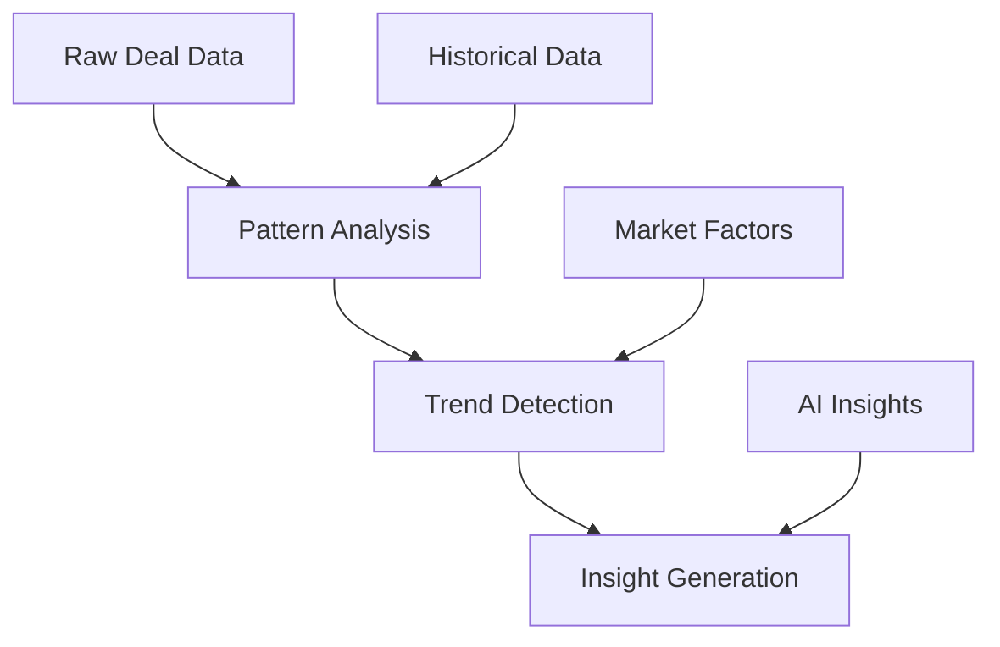
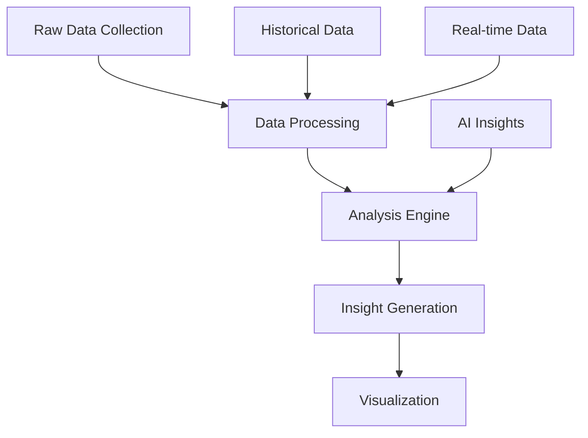

# Phase 3: Analytics & Optimization - Product Requirements Document

## Overview
Phase 3 focuses on implementing comprehensive analytics capabilities, performance optimizations, and actionable insights derived from both traditional CRM data and AI-powered features established in previous phases.

## Scope

### In Scope
- Win-loss analytics engine
- Performance optimization system
- Advanced reporting dashboard
- Data visualization components
- Export capabilities
- System monitoring

### Out of Scope
- Custom report builder
- Raw data access
- External BI tool integration
- Real-time analytics streaming
- Predictive modeling (covered in Phase 2)

## Assumptions & Dependencies
- Phases 1 and 2 are complete and stable
- Sufficient historical data available
- User adoption of previous phases
- Data quality standards maintained
- Performance baseline established

## Analytics Requirements

### 1. Win-Loss Analytics Engine

#### Data Schema Extensions
```sql
CREATE TABLE IF NOT EXISTS deal_outcomes (
  id UUID PRIMARY KEY DEFAULT uuid_generate_v4(),
  deal_id UUID REFERENCES deals(id),
  outcome_type VARCHAR(10) NOT NULL CHECK (outcome_type IN ('won', 'lost')),
  close_date TIMESTAMP WITH TIME ZONE,
  winning_factors JSONB,
  losing_factors JSONB,
  competitor_info JSONB,
  feedback TEXT,
  learning_points JSONB,
  created_at TIMESTAMP WITH TIME ZONE DEFAULT NOW()
);

CREATE TABLE IF NOT EXISTS success_factors (
  id UUID PRIMARY KEY DEFAULT uuid_generate_v4(),
  factor_name TEXT NOT NULL,
  factor_type VARCHAR(20) CHECK (factor_type IN ('technical', 'commercial', 'relationship', 'process')),
  impact_score NUMERIC,
  frequency INTEGER,
  created_at TIMESTAMP WITH TIME ZONE DEFAULT NOW()
);
```

#### Functionality
1. Outcome Analysis
```typescript
interface OutcomeAnalysis {
  dealMetrics: {
    totalValue: number;
    cycleLength: number;
    touchpoints: number;
    stakeholders: number;
  };
  keyFactors: {
    factor: string;
    impact: number;
    frequency: number;
    trend: 'increasing' | 'stable' | 'decreasing';
  }[];
  recommendations: string[];
}
```

2. Pattern Detection
   - Success pattern identification
   - Failure point analysis
   - Key decision factors
   - Competitive analysis

3. Trend Analysis


### 2. Performance Optimization System

#### Monitoring Schema
```sql
CREATE TABLE IF NOT EXISTS performance_metrics (
  id UUID PRIMARY KEY DEFAULT uuid_generate_v4(),
  metric_name TEXT NOT NULL,
  metric_value NUMERIC,
  timestamp TIMESTAMP WITH TIME ZONE DEFAULT NOW(),
  context JSONB
);

CREATE TABLE IF NOT EXISTS optimization_rules (
  id UUID PRIMARY KEY DEFAULT uuid_generate_v4(),
  rule_name TEXT NOT NULL,
  conditions JSONB,
  actions JSONB,
  priority INTEGER,
  enabled BOOLEAN DEFAULT true
);
```

#### Functionality
1. Performance Monitoring
   ```typescript
   interface PerformanceMetrics {
     pageLoadTime: number;
     apiLatency: number;
     resourceUtilization: {
       cpu: number;
       memory: number;
       network: number;
     };
     errorRate: number;
     userExperience: {
       fcp: number;  // First Contentful Paint
       lcp: number;  // Largest Contentful Paint
       fid: number;  // First Input Delay
       cls: number;  // Cumulative Layout Shift
     };
   }
   ```

2. Optimization Rules
   ```typescript
   interface OptimizationRule {
     name: string;
     condition: {
       metric: string;
       operator: 'gt' | 'lt' | 'eq';
       value: number;
     };
     action: {
       type: 'cache' | 'lazy-load' | 'optimize-query' | 'alert';
       parameters: Record<string, any>;
     };
     priority: number;
   }
   ```

3. Resource Management
   - Dynamic resource allocation
   - Cache optimization
   - Query performance tuning
   - Load balancing

### 3. Analytics Dashboard

#### Component Architecture
```typescript
interface DashboardConfig {
  layouts: {
    desktop: Layout[];
    tablet: Layout[];
    mobile: Layout[];
  };
  widgets: Widget[];
  refreshInterval: number;
  userPreferences: {
    defaultView: string;
    favoriteMetrics: string[];
    customRanges: DateRange[];
  };
}

interface Widget {
  id: string;
  type: WidgetType;
  dataSource: string;
  refreshInterval?: number;
  config: WidgetConfig;
  permissions: string[];
}
```

#### Visualization Components
1. Deal Analytics
   - Pipeline velocity
   - Conversion rates
   - Value distribution
   - Stage duration

2. Performance Metrics
   - System health
   - Response times
   - Error rates
   - Resource usage

3. AI Insights
   - Prediction accuracy
   - Model performance
   - Usage patterns
   - Learning curves

## Technical Architecture

### Analytics Service Layer
```typescript
interface AnalyticsService {
  // Win-Loss Analysis
  analyzeOutcome(dealId: string): Promise<OutcomeAnalysis>;
  detectPatterns(timeRange: DateRange): Promise<Pattern[]>;
  generateInsights(context: AnalysisContext): Promise<Insight[]>;
  
  // Performance Monitoring
  collectMetrics(): Promise<PerformanceMetrics>;
  applyOptimizations(rules: OptimizationRule[]): Promise<void>;
  
  // Reporting
  generateReport(config: ReportConfig): Promise<Report>;
  exportData(format: ExportFormat): Promise<ExportResult>;
}
```

### Data Processing Pipeline


### Optimization Engine
1. Caching Strategy
   - Multi-level caching
   - Cache invalidation rules
   - Cache warming
   - Cache analytics

2. Query Optimization
   - Query analysis
   - Index optimization
   - Query caching
   - Execution planning

## User Interface Requirements

### Analytics Dashboard
1. Layout
   - Responsive grid system
   - Customizable widgets
   - Drag-and-drop interface
   - Responsive breakpoints

2. Visualization Components
   ```typescript
   interface ChartConfig {
     type: 'line' | 'bar' | 'pie' | 'scatter' | 'custom';
     data: DataSource;
     options: ChartOptions;
     interactions: InteractionConfig[];
     animations: AnimationConfig[];
   }
   ```

3. Interactivity
   - Drill-down capabilities
   - Interactive filters
   - Real-time updates
   - Export options

### Performance Monitor
1. System Health Dashboard
   - Real-time metrics
   - Alert indicators
   - Trend visualizations
   - Resource usage

2. Optimization Controls
   - Rule management
   - Cache controls
   - Performance tuning
   - System settings

## Performance Requirements
- Dashboard load time < 2 seconds
- Chart render time < 500ms
- Data refresh rate < 1 minute
- Export handling < 30 seconds
- Concurrent user support: 200+

## Security & Compliance

### Data Protection
1. Access Control
   - Role-based access
   - Data masking
   - Audit logging
   - Export controls

2. Compliance
   - Data retention
   - Privacy regulations
   - Audit requirements
   - Security standards

## Testing Strategy

### Analytics Testing
1. Data Accuracy
   - Calculation validation
   - Aggregation testing
   - Trend analysis
   - Pattern detection

2. Performance Testing
   - Load testing
   - Stress testing
   - Endurance testing
   - Spike testing

### UI Testing
1. Visualization Tests
   - Rendering accuracy
   - Interaction testing
   - Responsiveness
   - Cross-browser compatibility

2. User Experience Tests
   - Navigation flows
   - Filter operations
   - Export functionality
   - Customization features

## Implementation Phases

### Week 1-2: Analytics Foundation
- Data pipeline setup
- Basic analytics engine
- Dashboard framework
- Initial visualizations

### Week 3-4: Performance Optimization
- Monitoring system
- Optimization rules
- Caching implementation
- Query optimization

### Week 5-6: Advanced Features
- Advanced analytics
- Custom visualizations
- Export system
- Documentation

## Success Metrics

### Quantitative Metrics
1. Performance
   - Page load time
   - Query response time
   - Cache hit ratio
   - Error rate

2. Usage
   - Daily active users
   - Feature adoption
   - Export frequency
   - Custom view creation

### Qualitative Metrics
1. User Satisfaction
   - Ease of use
   - Feature completeness
   - Data accuracy
   - Visual appeal

2. Business Impact
   - Decision-making improvement
   - Process optimization
   - Resource utilization
   - Cost reduction

## Risk Management

| Risk | Impact | Mitigation |
|------|--------|------------|
| Data accuracy | High | Validation systems, data quality checks |
| Performance degradation | High | Monitoring, optimization rules |
| User adoption | Medium | Training, documentation, UX focus |
| System scalability | High | Architecture review, load testing |
| Resource utilization | Medium | Optimization, monitoring |

## Future Considerations
- Machine learning integration
- Custom report builder
- Real-time analytics
- Mobile analytics app
- Integration APIs
- Advanced visualizations

## Appendix

### API Endpoints

```typescript
// Analytics
GET    /api/analytics/deals/outcomes
GET    /api/analytics/deals/patterns
GET    /api/analytics/insights

// Performance
GET    /api/performance/metrics
POST   /api/performance/optimize
GET    /api/performance/rules

// Reporting
GET    /api/reports/generate
POST   /api/reports/export
GET    /api/reports/templates
```

### Sample Analytics Response

```json
{
  "dealAnalytics": {
    "summary": {
      "totalDeals": 150,
      "winRate": 0.65,
      "averageValue": 75000,
      "cycleDuration": 45
    },
    "trends": [
      {
        "period": "2025-Q1",
        "metrics": {
          "winRate": 0.68,
          "value": 82000,
          "duration": 42
        }
      }
    ],
    "keyFactors": [
      {
        "name": "Stakeholder Engagement",
        "impact": 0.8,
        "frequency": 75,
        "trend": "increasing"
      }
    ]
  }
}
```

### Dashboard Layout Example

```typescript
const dashboardLayout = {
  desktop: [
    {
      id: 'deal-metrics',
      type: 'grid',
      cols: 2,
      rows: 2,
      widgets: ['win-rate', 'pipeline-value']
    },
    {
      id: 'performance',
      type: 'list',
      widgets: ['system-health', 'api-latency']
    }
  ],
  mobile: [
    {
      id: 'deal-metrics',
      type: 'stack',
      widgets: ['win-rate', 'pipeline-value']
    }
  ]
};