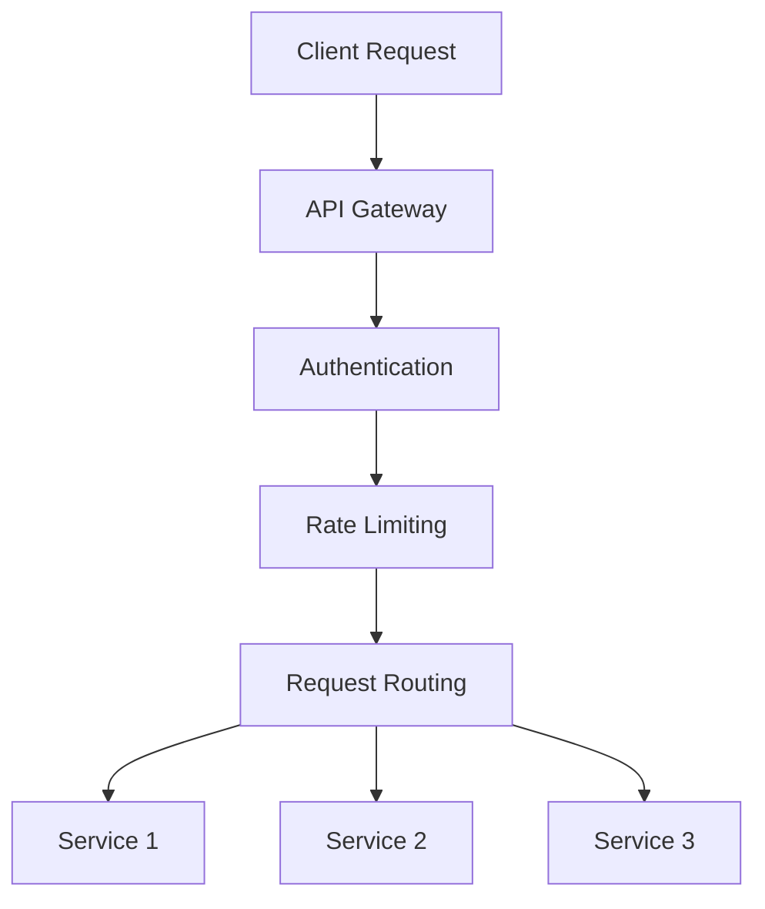

# Phase 4: Integration & API Ecosystem - Product Requirements Document

## Overview
Phase 4 focuses on building a robust integration ecosystem, enabling third-party connections, and providing extensive API capabilities for the CRM platform.

## Scope

### In Scope
- Public API development
- Third-party integrations
- Webhook system
- API documentation
- Integration marketplace
- Developer portal

### Out of Scope
- Custom integration development
- Legacy system migrations
- Direct database access
- On-premise deployment
- White-label solutions

## Assumptions & Dependencies
- Phases 1-3 are stable and production-ready
- API security infrastructure is in place
- Documentation system is ready
- Developer portal platform selected
- Rate limiting infrastructure exists

## Integration Requirements

### 1. Public API Platform

#### API Architecture
```typescript
interface APIConfig {
  version: string;
  baseUrl: string;
  auth: {
    type: 'oauth2' | 'api_key';
    scopes: string[];
    flowType: 'client_credentials' | 'authorization_code';
  };
  rateLimit: {
    requests: number;
    period: 'second' | 'minute' | 'hour';
    tierBased: boolean;
  };
}
```

#### Core API Features
1. Authentication & Authorization
   - OAuth 2.0 implementation
   - API key management
   - Scope-based access
   - Token management

2. Rate Limiting
   ```typescript
   interface RateLimitTier {
     name: string;
     limits: {
       requests: number;
       period: string;
       endpoints: string[];
     }[];
     price: number;
   }
   ```

3. Versioning System
   - Semantic versioning
   - Backwards compatibility
   - Deprecation notices
   - Version lifecycle

### 2. Webhook System

#### Schema Extensions
```sql
CREATE TABLE IF NOT EXISTS webhooks (
  id UUID PRIMARY KEY DEFAULT uuid_generate_v4(),
  user_id UUID NOT NULL,
  name TEXT NOT NULL,
  url TEXT NOT NULL,
  events TEXT[] NOT NULL,
  secret TEXT NOT NULL,
  active BOOLEAN DEFAULT true,
  created_at TIMESTAMP WITH TIME ZONE DEFAULT NOW(),
  last_triggered TIMESTAMP WITH TIME ZONE,
  failure_count INTEGER DEFAULT 0
);

CREATE TABLE IF NOT EXISTS webhook_deliveries (
  id UUID PRIMARY KEY DEFAULT uuid_generate_v4(),
  webhook_id UUID REFERENCES webhooks(id),
  event_type TEXT NOT NULL,
  payload JSONB NOT NULL,
  response_status INTEGER,
  response_body TEXT,
  created_at TIMESTAMP WITH TIME ZONE DEFAULT NOW()
);
```

#### Functionality
1. Event System
```typescript
interface WebhookEvent {
  id: string;
  type: string;
  created: number;
  data: {
    object: string;
    id: string;
    action: string;
    changes: Record<string, any>;
  };
}
```

2. Delivery Management
   - Retry logic
   - Failure handling
   - Event queuing
   - Delivery monitoring

### 3. Integration Marketplace

#### Marketplace Schema
```sql
CREATE TABLE IF NOT EXISTS integrations (
  id UUID PRIMARY KEY DEFAULT uuid_generate_v4(),
  name TEXT NOT NULL,
  description TEXT,
  category TEXT NOT NULL,
  publisher TEXT NOT NULL,
  version TEXT NOT NULL,
  config_schema JSONB,
  icon_url TEXT,
  documentation_url TEXT,
  created_at TIMESTAMP WITH TIME ZONE DEFAULT NOW()
);

CREATE TABLE IF NOT EXISTS integration_installations (
  id UUID PRIMARY KEY DEFAULT uuid_generate_v4(),
  integration_id UUID REFERENCES integrations(id),
  user_id UUID NOT NULL,
  config JSONB,
  status TEXT NOT NULL,
  created_at TIMESTAMP WITH TIME ZONE DEFAULT NOW(),
  last_synced TIMESTAMP WITH TIME ZONE
);
```

#### Integration Categories
1. Communication Tools
   - Email platforms
   - Video conferencing
   - Chat systems
   - Phone systems

2. Document Management
   - Cloud storage
   - Document signing
   - Contract management
   - File sharing

3. Marketing Tools
   - Email marketing
   - Social media
   - Analytics platforms
   - Marketing automation

4. Financial Systems
   - Payment processors
   - Accounting software
   - Billing systems
   - Expense management

## Technical Architecture

### API Gateway


### Integration Framework
```typescript
interface IntegrationHandler {
  // Core Methods
  initialize(config: IntegrationConfig): Promise<void>;
  sync(): Promise<SyncResult>;
  webhook(event: WebhookEvent): Promise<void>;
  
  // Data Methods
  importData(type: string, data: any[]): Promise<ImportResult>;
  exportData(type: string, query: Query): Promise<ExportResult>;
  
  // Utility Methods
  validateConfig(config: IntegrationConfig): Promise<ValidationResult>;
  testConnection(): Promise<boolean>;
}
```

### Developer Tools
1. SDK Components
```typescript
interface SDKConfig {
  apiKey: string;
  baseUrl: string;
  version: string;
  timeout: number;
  retries: number;
}

class CrmSDK {
  contacts: ContactAPI;
  deals: DealAPI;
  activities: ActivityAPI;
  webhooks: WebhookAPI;
}
```

2. Code Examples
```typescript
// Contact Creation
const contact = await crm.contacts.create({
  firstName: 'John',
  lastName: 'Doe',
  email: 'john@example.com'
});

// Webhook Registration
const webhook = await crm.webhooks.create({
  url: 'https://api.example.com/webhook',
  events: ['contact.created', 'deal.updated']
});
```

## User Interface Requirements

### Developer Portal
1. Documentation
   - API reference
   - Integration guides
   - Code samples
   - Swagger/OpenAPI specs

2. Testing Tools
   - API playground
   - Webhook tester
   - Request builder
   - Response validator

### Integration Management
1. Dashboard
   - Active integrations
   - Usage metrics
   - Error logs
   - Configuration

2. Marketplace
   - Integration catalog
   - Search/filter
   - Installation flow
   - Reviews/ratings

## Performance Requirements
- API response time < 200ms
- Webhook delivery < 5s
- Integration sync < 5 minutes
- 99.9% uptime
- Support for 1000+ req/s

## Security Requirements

### API Security
1. Authentication
   - OAuth 2.0
   - API keys
   - JWT tokens
   - HMAC validation

2. Data Protection
   - TLS 1.3
   - Field-level encryption
   - Data masking
   - Audit logging

## Testing Strategy

### API Testing
1. Unit Tests
   - Endpoint logic
   - Authentication
   - Rate limiting
   - Error handling

2. Integration Tests
   - Third-party connections
   - Webhook delivery
   - Data sync
   - Error scenarios

### Performance Testing
1. Load Testing
   - Concurrent requests
   - Rate limit enforcement
   - Resource usage
   - Response times

2. Security Testing
   - Penetration testing
   - Vulnerability scanning
   - Authentication tests
   - Authorization tests

## Implementation Phases

### Week 1-2: API Foundation
- API gateway setup
- Authentication system
- Basic endpoints
- Documentation framework

### Week 3-4: Integration System
- Webhook system
- Integration framework
- Marketplace foundation
- Developer tools

### Week 5-6: Advanced Features
- Advanced integrations
- Performance optimization
- Security hardening
- Developer portal

## Success Metrics

### Technical Metrics
1. API Performance
   - Response times
   - Error rates
   - Uptime
   - Usage volume

2. Integration Success
   - Integration adoption
   - Sync success rate
   - Webhook reliability
   - API usage growth

### Business Metrics
1. Developer Adoption
   - Registered developers
   - Active integrations
   - API key usage
   - Documentation engagement

2. Integration Usage
   - Active installations
   - Data sync volume
   - Webhook delivery rate
   - Support tickets

## Risk Management

| Risk | Impact | Mitigation |
|------|--------|------------|
| API abuse | High | Rate limiting, monitoring |
| Integration failures | Medium | Retry logic, alerts |
| Security breaches | High | Regular audits, updates |
| Performance issues | Medium | Monitoring, optimization |

## Future Considerations
- GraphQL API
- Real-time API
- Integration builder
- Advanced analytics
- Custom workflows
- Partner program

## Appendix

### API Endpoints

```typescript
// API Resources
GET    /api/v1/contacts
POST   /api/v1/contacts
GET    /api/v1/deals
POST   /api/v1/deals
GET    /api/v1/activities
POST   /api/v1/activities

// Integration Management
GET    /api/v1/integrations
POST   /api/v1/integrations/:id/install
DELETE /api/v1/integrations/:id/uninstall
GET    /api/v1/integrations/:id/status

// Webhook Management
GET    /api/v1/webhooks
POST   /api/v1/webhooks
GET    /api/v1/webhooks/:id/deliveries
```

### Sample Integration Config

```json
{
  "integration": {
    "name": "Email Marketing Pro",
    "version": "1.0.0",
    "config": {
      "apiKey": "xxx",
      "listId": "123",
      "syncInterval": 3600,
      "mappings": {
        "email": "contact.email",
        "firstName": "contact.first_name",
        "lastName": "contact.last_name"
      }
    },
    "permissions": [
      "contacts.read",
      "contacts.write",
      "activities.create"
    ]
  }
}