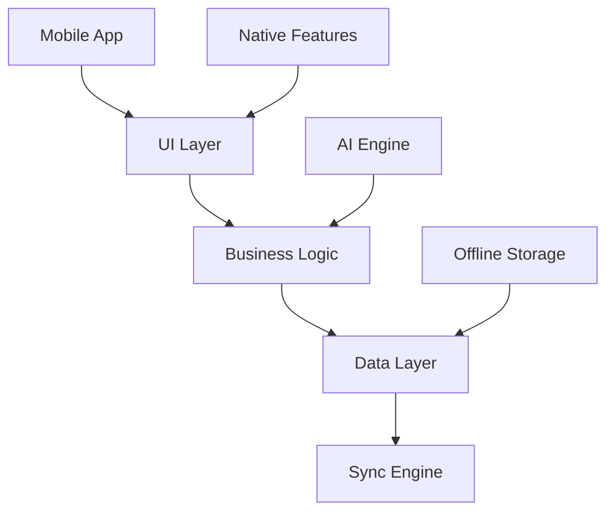
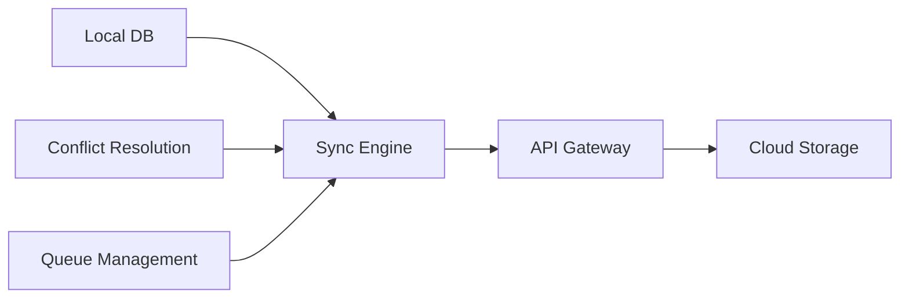

# Phase 5: Mobile & Advanced Features - Product Requirements Document

## Overview
Phase 5 focuses on delivering a comprehensive mobile experience and implementing advanced features that enhance the CRM platform's capabilities across all devices.

## Scope

### In Scope
- Native mobile applications (iOS/Android)
- Offline capabilities
- Push notifications
- Advanced collaboration features
- Voice integration
- Document scanning
- Mobile-specific AI features
- Location-based services

### Out of Scope
- Wearable device support
- AR/VR features
- IoT integration
- Cross-platform desktop apps
- Custom hardware integration

## Assumptions & Dependencies
- Phases 1-4 are complete and stable
- API platform supports mobile requirements
- Push notification infrastructure exists
- Mobile device management capability
- Cloud storage integration

## Mobile Application Requirements

### 1. Core Architecture

#### Technical Stack
```typescript
interface MobileConfig {
  platform: 'ios' | 'android';
  minimumOSVersion: string;
  targetOSVersion: string;
  architecture: {
    framework: 'react-native';
    stateManagement: 'redux-toolkit';
    networking: 'react-query';
    storage: 'realm';
  };
}
```

#### Features Matrix
1. Platform Support
   ```typescript
   interface PlatformSupport {
     ios: {
       minimum: '14.0';
       target: '17.0';
       devices: ['iPhone', 'iPad'];
     };
     android: {
       minimum: '8.0';
       target: '14.0';
       devices: ['Phone', 'Tablet'];
     };
   }
   ```

2. Device Capabilities
   - Camera integration
   - Biometric authentication
   - Push notifications
   - Location services
   - Background sync
   - File handling

### 2. Offline Capabilities

#### Data Sync Schema
```sql
CREATE TABLE IF NOT EXISTS sync_queue (
  id UUID PRIMARY KEY DEFAULT uuid_generate_v4(),
  entity_type TEXT NOT NULL,
  entity_id UUID NOT NULL,
  operation TEXT NOT NULL,
  data JSONB NOT NULL,
  status TEXT DEFAULT 'pending',
  created_at TIMESTAMP WITH TIME ZONE DEFAULT NOW(),
  sync_attempts INTEGER DEFAULT 0
);

CREATE TABLE IF NOT EXISTS offline_data (
  id UUID PRIMARY KEY DEFAULT uuid_generate_v4(),
  type TEXT NOT NULL,
  data JSONB NOT NULL,
  last_synced TIMESTAMP WITH TIME ZONE,
  version INTEGER,
  checksum TEXT
);
```

#### Functionality
1. Offline Data Management
```typescript
interface OfflineManager {
  // Data Operations
  syncData(): Promise<SyncResult>;
  queueOperation(op: Operation): Promise<void>;
  resolveConflicts(conflicts: Conflict[]): Promise<void>;
  
  // Storage Management
  manageStorage(): Promise<StorageStats>;
  prioritizeData(): Promise<void>;
  cleanupOldData(): Promise<void>;
}
```

2. Conflict Resolution
   - Last-write-wins strategy
   - Manual resolution interface
   - Merge capabilities
   - Version tracking

### 3. Mobile-Specific Features

#### Location Services
```typescript
interface LocationFeatures {
  // Check-ins
  recordVisit(location: Location): Promise<Visit>;
  getNearbyContacts(radius: number): Promise<Contact[]>;
  
  // Route Planning
  optimizeRoute(visits: Visit[]): Promise<Route>;
  trackTravelTime(visit: Visit): Promise<TravelStats>;
}
```

#### Document Scanning
1. Business Card Scanner
   ```typescript
   interface CardScanner {
     scanCard(): Promise<ContactData>;
     extractText(): Promise<TextData>;
     validateFields(): Promise<ValidationResult>;
     suggestEnhancements(): Promise<Suggestions>;
   }
   ```

2. Document Processing
   - OCR capabilities
   - PDF generation
   - Digital signing
   - Cloud storage sync

## Advanced Features

### 1. Voice Integration

#### Voice Command System
```typescript
interface VoiceSystem {
  // Command Processing
  processCommand(audio: AudioInput): Promise<Command>;
  executeAction(command: Command): Promise<ActionResult>;
  
  // Voice Notes
  recordNote(dealId: string): Promise<Note>;
  transcribeAudio(audio: AudioInput): Promise<Transcript>;
}
```

#### Voice Features
1. Command Support
   - Contact search
   - Deal updates
   - Activity logging
   - Meeting notes
   - Task creation
   - Reminders

2. Voice Notes
   - Real-time transcription
   - Speaker identification
   - Action item extraction
   - Context tagging

### 2. Advanced Collaboration

#### Team Coordination
```typescript
interface TeamFeatures {
  // Real-time Collaboration
  shareContext(context: Context): Promise<void>;
  updateTeam(update: Update): Promise<void>;
  
  // Task Management
  assignTask(task: Task): Promise<Assignment>;
  trackProgress(taskId: string): Promise<Progress>;
}
```

#### Communication Tools
1. In-App Messaging
   - Team channels
   - Direct messages
   - File sharing
   - Rich media support

2. Video Conferencing
   - One-click meetings
   - Screen sharing
   - Recording
   - Meeting notes

### 3. Mobile AI Features

#### Smart Assistant
```typescript
interface MobileAI {
  // Context Awareness
  analyzeLocation(): Promise<LocationContext>;
  suggestActions(): Promise<Action[]>;
  
  // Real-time Intelligence
  processImage(image: Image): Promise<ImageAnalysis>;
  analyzeSpeech(audio: Audio): Promise<SpeechAnalysis>;
}
```

#### AI Capabilities
1. Real-time Processing
   - Image recognition
   - Speech analysis
   - Context awareness
   - Predictive suggestions

2. Offline AI
   - On-device models
   - Cached predictions
   - Battery optimization
   - Storage management

## Technical Architecture

### Mobile App Architecture


### Sync Architecture


## User Interface Requirements

### Mobile UI Components
1. Navigation
   - Bottom navigation
   - Gesture support
   - Quick actions
   - Search accessibility

2. List Views
   - Pull to refresh
   - Infinite scroll
   - Swipe actions
   - Sort/filter

3. Detail Views
   - Responsive layouts
   - Card interfaces
   - Action sheets
   - Modal dialogs

### Mobile-Specific UX
1. Touch Interactions
   - Gesture controls
   - Haptic feedback
   - 3D Touch support
   - Drag and drop

2. Responsive Design
   - Screen adaptability
   - Orientation support
   - Split view (iPad)
   - Dynamic type

## Performance Requirements
- App launch time < 2s
- Smooth scrolling (60 fps)
- Offline data access < 100ms
- Background sync < 5min
- Battery impact < 5%/hour

## Security Requirements

### Mobile Security
1. Authentication
   - Biometric auth
   - 2FA support
   - Session management
   - Secure keychain

2. Data Protection
   - At-rest encryption
   - Secure communication
   - Certificate pinning
   - Jailbreak detection

## Testing Strategy

### Mobile Testing
1. Device Testing
   - Multiple devices
   - OS versions
   - Screen sizes
   - Network conditions

2. Feature Testing
   - Offline mode
   - Push notifications
   - Background tasks
   - Battery usage

### Performance Testing
1. Mobile Metrics
   - Launch time
   - Memory usage
   - Battery impact
   - Network usage

2. Load Testing
   - Concurrent users
   - Data sync
   - API calls
   - Cache performance

## Implementation Phases

### Week 1-2: Mobile Foundation
- Project setup
- Core architecture
- Basic UI
- Navigation flow

### Week 3-4: Core Features
- Offline support
- Data sync
- Native features
- Basic AI

### Week 5-6: Advanced Features
- Voice integration
- Document scanning
- Advanced AI
- Collaboration tools

## Success Metrics

### Technical Metrics
1. Performance
   - App size
   - Launch time
   - Frame rate
   - Crash rate

2. Usage
   - Daily active users
   - Session length
   - Feature adoption
   - Offline usage

### Business Metrics
1. User Engagement
   - Mobile vs web usage
   - Feature utilization
   - Collaboration metrics
   - Task completion

2. Efficiency Gains
   - Time saved
   - Data accuracy
   - Process automation
   - Team productivity

## Risk Management

| Risk | Impact | Mitigation |
|------|--------|------------|
| Device compatibility | High | Extensive testing |
| Battery drain | Medium | Optimization |
| Data sync issues | High | Robust sync engine |
| Offline conflicts | Medium | Resolution system |

## Future Considerations
- Wearable integration
- AR features
- IoT connectivity
- Cross-platform desktop
- Advanced biometrics

## Appendix

### API Requirements

```typescript
// Mobile-specific Endpoints
GET    /api/v1/mobile/sync
POST   /api/v1/mobile/offline
GET    /api/v1/mobile/config
POST   /api/v1/mobile/feedback

// Location Services
GET    /api/v1/locations/nearby
POST   /api/v1/locations/checkin
GET    /api/v1/locations/optimize

// Voice Features
POST   /api/v1/voice/process
POST   /api/v1/voice/transcribe
```

### Offline Data Structure

```json
{
  "syncConfig": {
    "priorities": {
      "contacts": 1,
      "deals": 2,
      "activities": 3
    },
    "syncInterval": 300,
    "maxRetries": 3
  },
  "dataLimits": {
    "contacts": 1000,
    "deals": 500,
    "activities": 1000
  },
  "cacheRules": {
    "images": "7days",
    "documents": "30days",
    "audio": "2days"
  }
}
```

### Mobile UI Layouts

```typescript
const mobileLayouts = {
  dashboard: {
    type: 'scroll',
    sections: [
      {
        type: 'cards',
        items: ['deals', 'tasks']
      },
      {
        type: 'list',
        items: ['activities']
      }
    ]
  },
  detail: {
    type: 'tabs',
    sections: [
      'info',
      'activities',
      'documents'
    ]
  }
};