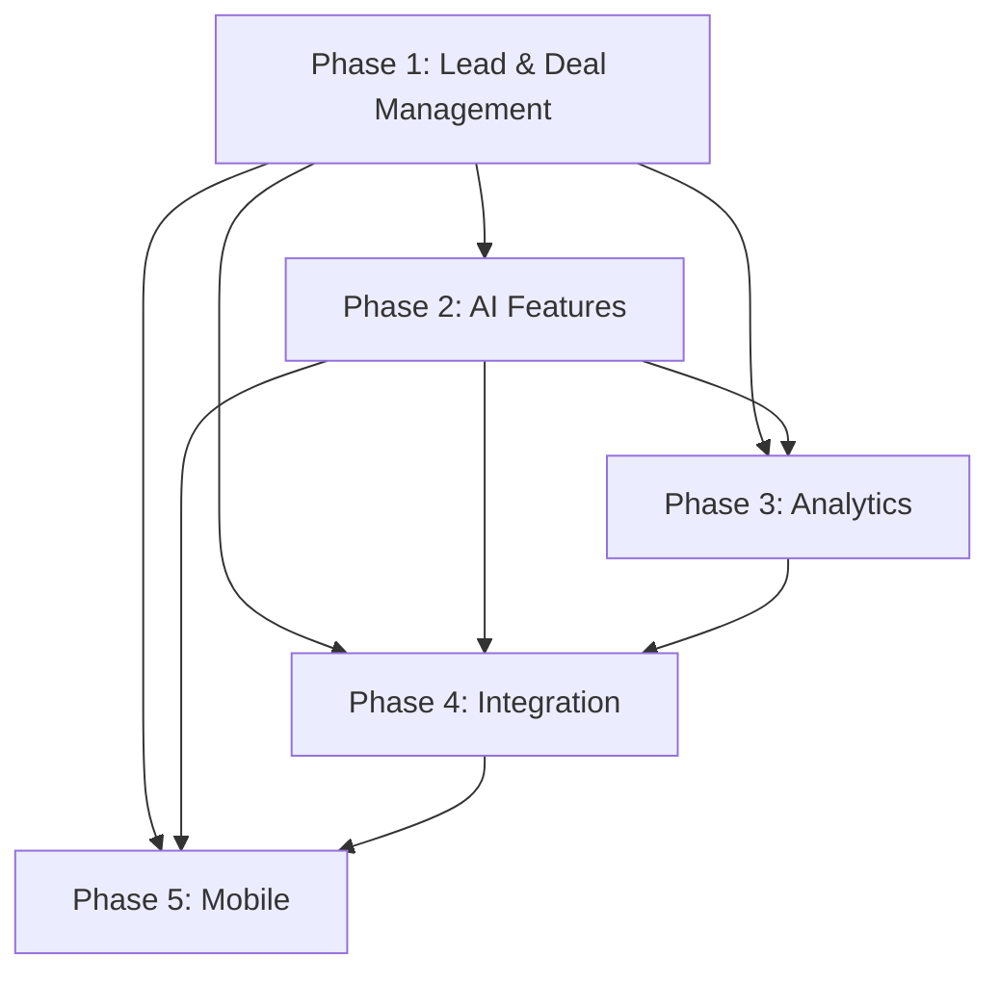
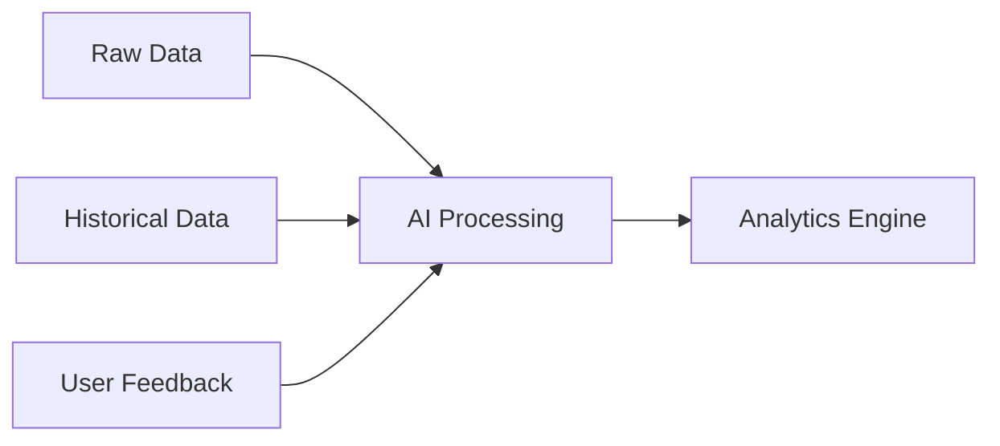
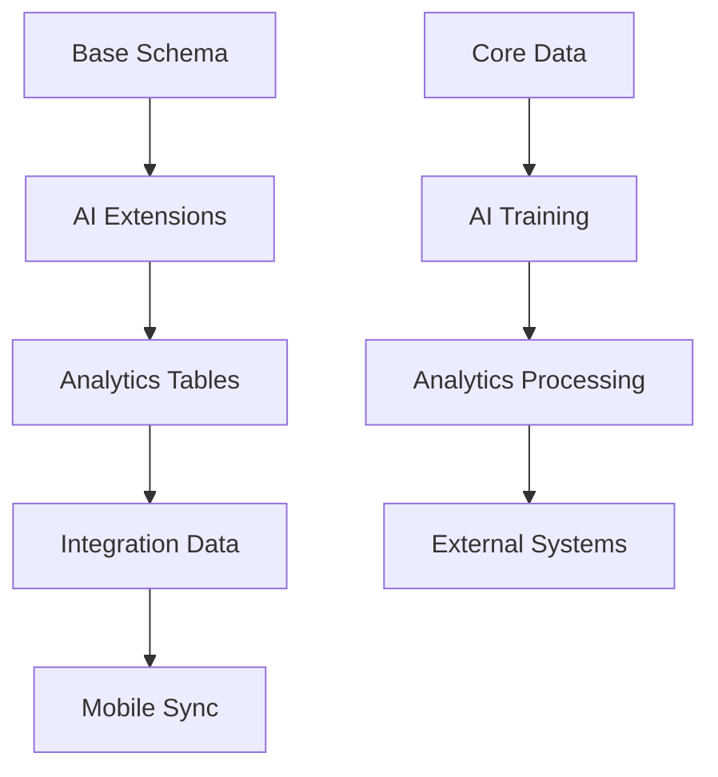
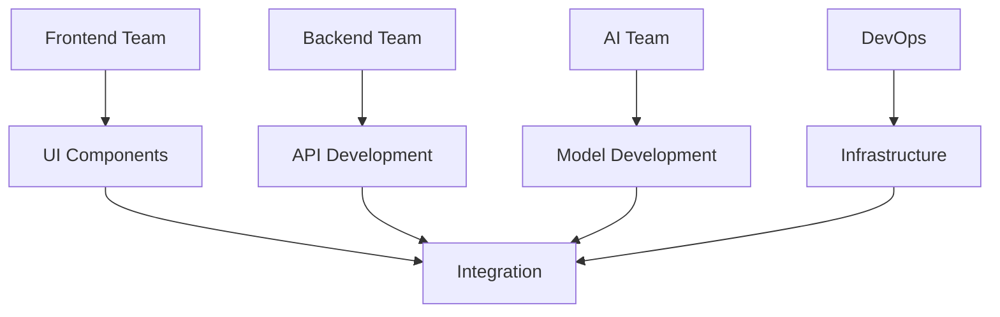
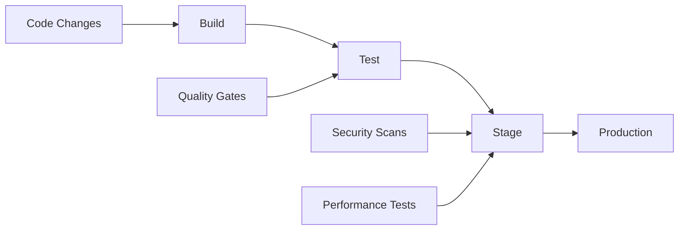

# Phase Dependencies and Implementation Timeline

## Phase Dependencies Overview



## Critical Dependencies Analysis

### Phase 1 → Phase 2
1. Data Requirements
   - Contact profiles must be complete
   - Deal pipeline stages defined
   - Activity tracking implemented
   - Basic data validation in place

2. Technical Prerequisites
   ```typescript
   interface Phase1Dependencies {
     database: {
       tables: ['contacts', 'deals', 'activities'];
       dataQuality: 'validated';
       minRecords: 100;
     };
     api: {
       endpoints: ['CRUD operations'];
       authentication: 'implemented';
       rateLimit: 'configured';
     };
     frontend: {
       components: ['forms', 'lists', 'details'];
       stateManagement: 'stable';
     };
   }
   ```

### Phase 2 → Phase 3
1. AI Integration Requirements
   - AI models trained and validated
   - Prediction endpoints stable
   - Data processing pipeline established
   - Error handling implemented

2. Data Flow Dependencies


### Phase 3 → Phase 4
1. Analytics Requirements
   - Metrics definition complete
   - Data aggregation implemented
   - Reporting engine stable
   - Performance baselines established

2. Integration Points
```typescript
interface AnalyticsIntegration {
  metrics: {
    required: string[];
    format: string;
    frequency: string;
  };
  apis: {
    endpoints: string[];
    authentication: string;
    dataFormats: string[];
  };
  reporting: {
    types: string[];
    exports: string[];
    scheduling: boolean;
  };
}
```

### Phase 4 → Phase 5
1. API Requirements
   - Mobile-specific endpoints
   - Offline sync support
   - Push notification system
   - File handling capabilities

2. Mobile Prerequisites
```yaml
mobile_dependencies:
  api:
    - RESTful endpoints
    - Real-time capabilities
    - Binary data handling
    - Authentication flows
    
  sync:
    - Offline data storage
    - Conflict resolution
    - Delta updates
    - Background sync
    
  notifications:
    - Push infrastructure
    - Topic management
    - Deep linking
```

## Cross-Phase Dependencies

### Data Layer Dependencies


### Authentication & Authorization
1. Progressive Implementation
```typescript
interface AuthProgressions {
  phase1: {
    basic: ['email', 'password'];
    roles: ['admin', 'user'];
  };
  phase2: {
    ai: ['model access', 'usage limits'];
  };
  phase3: {
    analytics: ['report access', 'export rights'];
  };
  phase4: {
    integration: ['API keys', 'OAuth'];
  };
  phase5: {
    mobile: ['biometric', 'offline access'];
  };
}
```

### Performance Requirements
```yaml
performance_dependencies:
  phase1:
    response_time: 200ms
    concurrent_users: 100
    data_volume: 10GB
    
  phase2:
    ai_response: 500ms
    model_accuracy: 90%
    training_data: 1000 records
    
  phase3:
    report_generation: 3s
    data_processing: 1M records
    export_time: 30s
    
  phase4:
    api_latency: 100ms
    webhook_delivery: 5s
    sync_time: 1min
    
  phase5:
    app_launch: 2s
    offline_sync: 5min
    storage_limit: 1GB
```

## Implementation Timeline

### Critical Path
1. Phase 1 Core Features (8 weeks)
   - Database setup (2 weeks)
   - API development (3 weeks)
   - Frontend implementation (3 weeks)

2. Phase 2 AI Integration (6 weeks)
   - Model setup (2 weeks)
   - Integration (2 weeks)
   - Training & validation (2 weeks)

3. Phase 3 Analytics (4 weeks)
   - Data processing (1 week)
   - Analytics engine (2 weeks)
   - Visualization (1 week)

4. Phase 4 Integration (4 weeks)
   - API platform (2 weeks)
   - Webhooks (1 week)
   - Documentation (1 week)

5. Phase 5 Mobile (6 weeks)
   - Core app (3 weeks)
   - Offline sync (2 weeks)
   - Native features (1 week)

## Risk Assessment

### Technical Risks
| Risk Area | Impact | Mitigation Strategy |
|-----------|--------|-------------------|
| Data Migration | High | Incremental migration, validation |
| AI Integration | High | Phased rollout, fallback options |
| Performance | Medium | Regular testing, optimization |
| Mobile Sync | Medium | Robust conflict resolution |

### Resource Dependencies


## Transition Points

### Phase 1 → 2 Transition
1. Validation Checklist
   - [ ] Data quality metrics met
   - [ ] API stability confirmed
   - [ ] User adoption metrics achieved
   - [ ] Performance baselines met

2. Handover Requirements
```typescript
interface Phase1Handover {
  documentation: {
    api: boolean;
    database: boolean;
    architecture: boolean;
  };
  metrics: {
    performance: boolean;
    adoption: boolean;
    stability: boolean;
  };
  training: {
    users: boolean;
    support: boolean;
    developers: boolean;
  };
}
```

### Phase 2 → 3 Transition
1. AI Readiness Checklist
   - [ ] Model accuracy targets met
   - [ ] Processing pipeline stable
   - [ ] Error handling validated
   - [ ] Monitoring in place

2. Analytics Prerequisites
```yaml
analytics_readiness:
  data:
    - Quality validated
    - Volume sufficient
    - Structure optimized
    
  processing:
    - Pipeline tested
    - Performance verified
    - Scaling confirmed
    
  access:
    - Permissions set
    - API endpoints ready
    - Security reviewed
```

### Phase 3 → 4 Transition
1. Integration Readiness
   - [ ] API documentation complete
   - [ ] Performance requirements met
   - [ ] Security measures implemented
   - [ ] Monitoring system active

2. External System Requirements
```typescript
interface IntegrationReadiness {
  api: {
    documentation: boolean;
    testing: boolean;
    security: boolean;
  };
  monitoring: {
    metrics: boolean;
    alerts: boolean;
    logging: boolean;
  };
  support: {
    documentation: boolean;
    examples: boolean;
    sandboxes: boolean;
  };
}
```

### Phase 4 → 5 Transition
1. Mobile Prerequisites
   - [ ] API endpoints optimized
   - [ ] Authentication flows ready
   - [ ] File handling implemented
   - [ ] Push notifications tested

2. Infrastructure Requirements
```yaml
mobile_infrastructure:
  api:
    - Mobile optimization
    - Binary handling
    - Cache strategy
    
  storage:
    - Offline data
    - File sync
    - Encryption
    
  notifications:
    - Push services
    - Deep linking
    - Background tasks
```

## Continuous Integration/Deployment

### Pipeline Dependencies


### Environment Strategy
```typescript
interface EnvironmentStrategy {
  development: {
    features: 'all';
    data: 'synthetic';
    ai: 'mock';
  };
  staging: {
    features: 'all';
    data: 'anonymized';
    ai: 'test';
  };
  production: {
    features: 'released';
    data: 'live';
    ai: 'production';
  };
}
```

## Success Criteria

### Phase Completion Requirements
```yaml
completion_criteria:
  phase1:
    - Core functionality working
    - Data validation passed
    - Performance targets met
    - User acceptance confirmed
    
  phase2:
    - AI models validated
    - Prediction accuracy met
    - Integration stable
    - User feedback positive
    
  phase3:
    - Analytics reliable
    - Reports accurate
    - Performance acceptable
    - Data integrity confirmed
    
  phase4:
    - API platform stable
    - Integrations working
    - Documentation complete
    - Developer adoption started
    
  phase5:
    - Mobile app stable
    - Offline sync working
    - Performance optimized
    - User experience validated