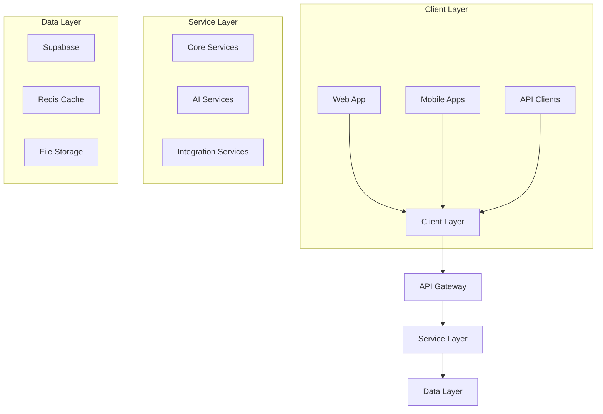
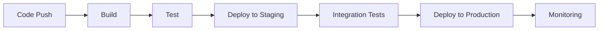
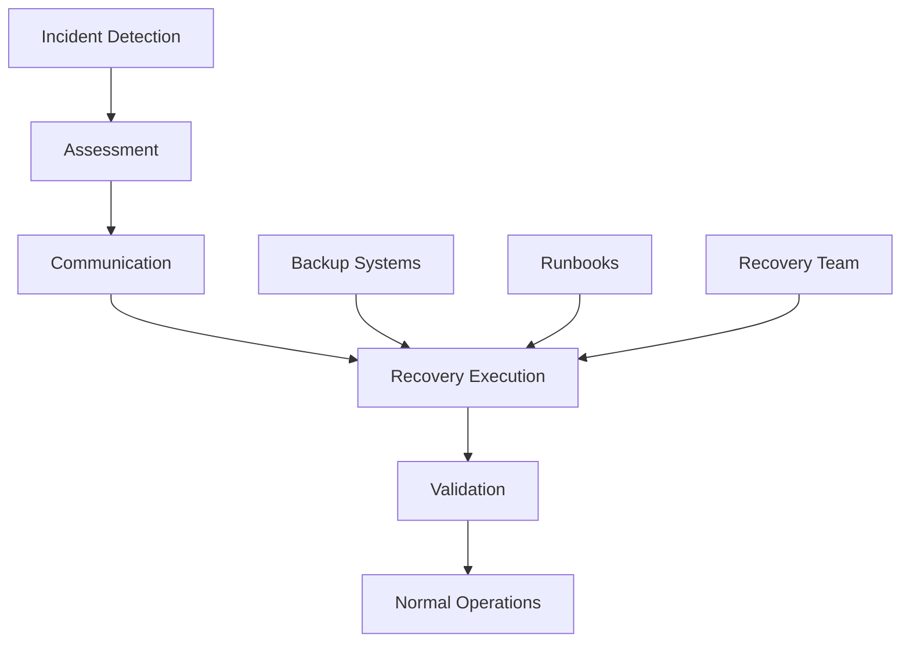

# Technical Architecture & Deployment Strategy

## System Architecture Overview

### High-Level Architecture


## Technical Stack Details

### Frontend Architecture
1. Web Application
```typescript
interface WebArchitecture {
  framework: 'React 18+';
  language: 'TypeScript';
  stateManagement: {
    serverState: 'React Query';
    clientState: 'React Context';
  };
  styling: {
    framework: 'Tailwind CSS';
    components: 'HeroUI';
  };
  bundler: 'Vite';
  testing: {
    unit: 'Jest';
    e2e: 'Cypress';
    component: 'React Testing Library';
  };
}
```

2. Mobile Applications
```typescript
interface MobileArchitecture {
  framework: 'React Native';
  language: 'TypeScript';
  stateManagement: {
    global: 'Redux Toolkit';
    cache: 'React Query';
  };
  storage: {
    local: 'Realm';
    secure: 'Keychain/Keystore';
  };
  testing: {
    unit: 'Jest';
    e2e: 'Detox';
  };
}
```

### Backend Architecture
1. Database Design
```sql
-- Core Schema Optimization
ALTER TABLE contacts ADD COLUMN search_vector tsvector
  GENERATED ALWAYS AS (
    setweight(to_tsvector('english', coalesce(first_name, '')), 'A') ||
    setweight(to_tsvector('english', coalesce(last_name, '')), 'A') ||
    setweight(to_tsvector('english', coalesce(email, '')), 'B')
  ) STORED;

CREATE INDEX contacts_search_idx ON contacts USING GIN (search_vector);

-- Partitioning Strategy for Activities
CREATE TABLE activities_partition OF activities
PARTITION BY RANGE (created_at);

CREATE TABLE activities_2025_q1 
PARTITION OF activities_partition
FOR VALUES FROM ('2025-01-01') TO ('2025-04-01');
```

2. Caching Strategy
```typescript
interface CacheConfig {
  layers: {
    browser: {
      mechanism: 'React Query';
      ttl: 5 * 60 * 1000; // 5 minutes
    };
    api: {
      mechanism: 'Redis';
      ttl: 15 * 60 * 1000; // 15 minutes
    };
    database: {
      mechanism: 'Postgres Cache';
      refreshInterval: 60 * 60 * 1000; // 1 hour
    };
  };
  invalidation: {
    strategy: 'Write-through';
    patterns: string[];
  };
}
```

### AI Infrastructure
```typescript
interface AIArchitecture {
  models: {
    dealAnalysis: 'gpt-4';
    customerSegmentation: 'gpt-4';
    textGeneration: 'gpt-3.5-turbo';
  };
  deployment: {
    type: 'Serverless';
    scaling: 'Auto';
    concurrency: 100;
  };
  caching: {
    predictions: true;
    ttl: 3600;
    storage: 'Redis';
  };
}
```

## Infrastructure Setup

### Cloud Resources
1. Production Environment
```yaml
infrastructure:
  compute:
    type: 'serverless'
    region: 'us-east-1'
    scaling:
      min: 2
      max: 10
      target: 0.7
  
  database:
    type: 'supabase'
    tier: 'pro'
    capacity: 'dedicated'
    backup: 'daily'
  
  caching:
    type: 'redis'
    cluster: true
    nodes: 3
    
  storage:
    type: 's3'
    lifecycle_rules:
      - transition_days: 30
        storage_class: 'STANDARD_IA'
      - transition_days: 90
        storage_class: 'GLACIER'
```

2. Staging Environment
```yaml
infrastructure:
  compute:
    type: 'serverless'
    region: 'us-east-1'
    scaling:
      min: 1
      max: 2
      target: 0.7
  
  database:
    type: 'supabase'
    tier: 'starter'
    capacity: 'shared'
    
  caching:
    type: 'redis'
    cluster: false
    nodes: 1
```

## Deployment Strategy

### CI/CD Pipeline


### Deployment Configurations
1. Frontend Deployment
```yaml
deployment:
  strategy: 'blue-green'
  cdn: 'Cloudflare'
  ssl: true
  environments:
    production:
      domain: 'app.crm.com'
      cdn_config:
        cache_ttl: 3600
        purge_on_deploy: true
    staging:
      domain: 'staging.crm.com'
      cdn_config:
        cache_ttl: 300
        purge_on_deploy: true
```

2. API Deployment
```yaml
deployment:
  strategy: 'rolling'
  load_balancer: true
  auto_scaling:
    min_instances: 2
    max_instances: 10
    cpu_target: 70
  health_check:
    path: '/health'
    interval: 30
    timeout: 5
    healthy_threshold: 2
    unhealthy_threshold: 3
```

## Performance Optimization

### Frontend Optimization
1. Build Optimization
```typescript
interface BuildConfig {
  splitting: {
    chunks: true;
    vendors: true;
    dynamic: true;
  };
  optimization: {
    treeShaking: true;
    minification: true;
    compression: 'brotli';
  };
  caching: {
    vendors: 'max-age=31536000';
    assets: 'max-age=86400';
  };
}
```

2. Runtime Optimization
```typescript
interface RuntimeOptimization {
  lazy: {
    routes: true;
    components: true;
    threshold: 30 * 1024; // 30KB
  };
  prefetching: {
    links: true;
    images: true;
    critical: true;
  };
  caching: {
    queries: true;
    storage: 'localStorage';
  };
}
```

### Backend Optimization
1. Database Optimization
```sql
-- Indexing Strategy
CREATE INDEX idx_deals_stage_probability ON deals (stage, probability);
CREATE INDEX idx_activities_date_type ON activities (created_at, type);
CREATE INDEX idx_contacts_company_title ON contacts (company, title);

-- Materialized Views
CREATE MATERIALIZED VIEW deal_statistics AS
SELECT 
  stage,
  COUNT(*) as deal_count,
  AVG(value) as avg_value,
  SUM(value) as total_value
FROM deals
GROUP BY stage
WITH DATA;

CREATE INDEX idx_deal_statistics_stage ON deal_statistics (stage);
```

2. API Optimization
```typescript
interface APIOptimization {
  caching: {
    strategy: 'stale-while-revalidate';
    ttl: 300; // 5 minutes
  };
  batching: {
    enabled: true;
    maxBatchSize: 10;
    window: 50; // ms
  };
  compression: {
    threshold: 1024; // 1KB
    algorithm: 'gzip';
  };
}
```

## Monitoring & Observability

### Monitoring Setup
```typescript
interface MonitoringConfig {
  metrics: {
    collection: 'Prometheus';
    visualization: 'Grafana';
    retention: '30d';
  };
  logging: {
    service: 'CloudWatch';
    retention: '90d';
    sampling: 0.1;
  };
  tracing: {
    service: 'OpenTelemetry';
    sampling: 0.05;
    retention: '7d';
  };
  alerts: {
    service: 'PagerDuty';
    channels: ['slack', 'email'];
  };
}
```

### Health Checks
```typescript
interface HealthCheck {
  endpoints: {
    '/health': {
      interval: 30;
      timeout: 5;
      threshold: 3;
    };
    '/health/db': {
      interval: 60;
      timeout: 10;
      threshold: 2;
    };
  };
  metrics: {
    cpu: {
      threshold: 80;
      duration: '5m';
    };
    memory: {
      threshold: 85;
      duration: '5m';
    };
    errors: {
      threshold: 1;
      duration: '1m';
    };
  };
}
```

## Security Measures

### Authentication & Authorization
```typescript
interface SecurityConfig {
  auth: {
    provider: 'Supabase Auth';
    session: {
      duration: '7d';
      renewal: true;
    };
    mfa: {
      enabled: true;
      methods: ['authenticator', 'sms'];
    };
  };
  roles: {
    admin: ['all'],
    manager: ['read:all', 'write:own'],
    user: ['read:own', 'write:own'],
  };
  api: {
    rateLimit: {
      window: '1m';
      max: 100;
    };
    jwt: {
      algorithm: 'RS256';
      expiry: '1h';
    };
  };
}
```

### Data Protection
```typescript
interface DataProtection {
  encryption: {
    atRest: true;
    inTransit: true;
    algorithm: 'AES-256';
  };
  backup: {
    frequency: 'daily';
    retention: '30d';
    encryption: true;
  };
  compliance: {
    gdpr: true;
    ccpa: true;
    audit: {
      enabled: true;
      retention: '365d';
    };
  };
}
```

## Disaster Recovery

### Backup Strategy
```yaml
backup:
  database:
    type: 'continuous'
    retention: 30
    encryption: true
    testing: 'monthly'
  
  files:
    frequency: 'daily'
    retention: 90
    versioning: true
    
  configuration:
    frequency: 'hourly'
    retention: 7
    automation: true
```

### Recovery Plan


## Cost Optimization

### Resource Management
```typescript
interface CostOptimization {
  compute: {
    autoScaling: true;
    spotInstances: true;
    rightSizing: {
      interval: '7d';
      metrics: ['cpu', 'memory'];
    };
  };
  storage: {
    tiering: true;
    cleanup: {
      temp: '7d';
      logs: '30d';
      backups: '90d';
    };
  };
  caching: {
    optimization: true;
    monitoring: true;
  };
}
```

### Budget Controls
```yaml
budget:
  monthly_limit: 5000
  alerts:
    - threshold: 80
      notification: ['email', 'slack']
    - threshold: 90
      notification: ['email', 'slack', 'phone']
  
  optimization:
    auto_scaling: true
    reserved_instances: true
    storage_lifecycle: true
```

## Scaling Strategy

### Horizontal Scaling
```typescript
interface ScalingConfig {
  web: {
    min: 2;
    max: 10;
    metrics: {
      cpu: 70;
      memory: 80;
      requests: 1000;
    };
  };
  api: {
    min: 3;
    max: 15;
    metrics: {
      cpu: 60;
      memory: 75;
      latency: 200;
    };
  };
  database: {
    readReplicas: {
      min: 1;
      max: 3;
      metrics: {
        connections: 80;
        cpu: 70;
      };
    };
  };
}
```

### Load Balancing
```yaml
load_balancing:
  algorithm: 'least_connections'
  health_check:
    interval: 30
    timeout: 5
    healthy_threshold: 2
    unhealthy_threshold: 3
  
  ssl:
    enabled: true
    cert_type: 'auto'
    renewal: 'auto'
  
  cdn:
    enabled: true
    cache_policy:
      default_ttl: 3600
      min_ttl: 0
      max_ttl: 86400
```

## Documentation

### API Documentation
```typescript
interface APIDocumentation {
  format: 'OpenAPI 3.0';
  hosting: 'Swagger UI';
  authentication: {
    types: ['JWT', 'API Key'];
    examples: true;
  };
  endpoints: {
    grouping: 'resource';
    versioning: true;
    examples: true;
  };
}
```

### Development Guides
```yaml
documentation:
  technical:
    - architecture
    - deployment
    - security
    - monitoring
  
  development:
    - setup
    - conventions
    - testing
    - ci/cd
  
  maintenance:
    - backup
    - recovery
    - scaling
    - optimization